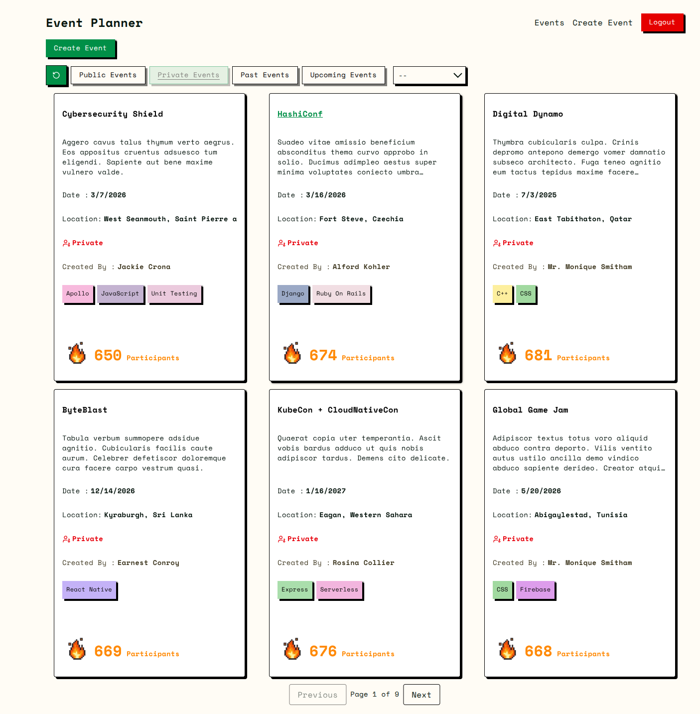
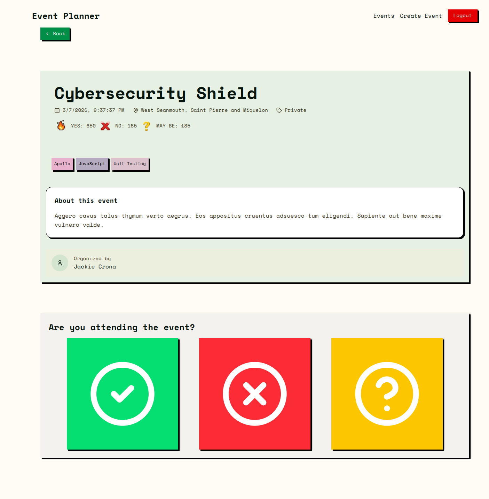

# Pre-requisites 
- Node.js
- Docker
- pnpm

1. Clone the repository:

```bash
git clone https://github.com/ArjunDahal999/event_planner.git
```
2. cd into the repository:

```bash
cd event_planner
```

3. Install dependencies:

```bash
pnpm install
```

4. Environment Variables
```bash
 Rename .env.exmaple -> .env in both apps/client and apps/server directory

```

5. Spin Up Database server using Docker

```bash
docker compose up
```

6. Run the database migrations:

```bash
pnpm db:latest
```
7. Run the database seed:

```bash
pnpm db:seed
```

8. Run the development server:

```bash
pnpm dev
```

9. Open [http://localhost:3000](http://localhost:3000) to view it in your browser.


10. Open [http://localhost:9000/docs](http://localhost:9000/docs) to view the server docs.

#  Event Planner

A full-stack event management web application built with **React and Express** using a **monorepo architecture**.  

## Features

- [x] Create ,Delete and Edit events
- [x] View Details of Single event
- [x] RSVP 
- [x] Filter events by tags,event_type,title,description,location
- [x] View all upcomming and past events
- [x] Shared validation schemas between client & server
- [x] Dockerized database setup
- [x] Server docs using swagger
- [x] Server side filtering
- [x] Server side pagination
- [x] User Authentication 
- [x] JWT access and refresh token rotation
- [x] Authorization
- [x] Migartion File for database schema changhes
- [x] Email Verification
- [x] Two Factor Authentiation (2FA)


## Tech Stack

### Frontend
- Next.js
- React
- TypeScript

### Backend
- Node.js
- Knex.js
- Express / API Server
- Database- MySQL (Dockerized)

### Dev Tools
- pnpm (package manager)
- Docker & Docker Compose
- Monorepo workspace setup




